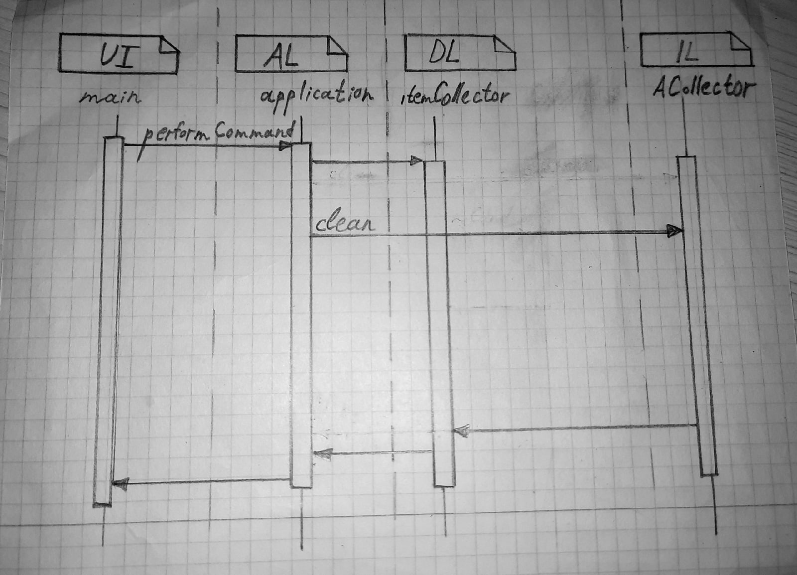

Министерство науки и высшего образования Российской Федерации  
Федеральное государственное бюджетное образовательное учреждение  
высшего образования  
«Московский государственный технический университет  
имени Н.Э. Баумана  
(национальный исследовательский университет)»  
(МГТУ им. Н.Э. Баумана)

ФАКУЛЬТЕТ ИНФОРМАТИКА И СИСТЕМЫ УПРАВЛЕНИЯ  
КАФЕДРА КОМПЬЮТЕРНЫЕ СИСТЕМЫ И СЕТИ (ИУ6)

 

ОТЧЕТ  
к лабораторной работе №3  
по дисциплине "Современные средства разработки  
программного обеспечения"  
Описание модели, изоляция предметной области.

 

Преподаватель: Фетисов М.В.

Студенты группы ИУ6-52Б .

## Описание задания

Задача № 2 (карточка 14 - "Выборы в муниципалитет"): 

Постройте диаграмму последовательности выполнения команды clean. Диаграмма должна показывать прохождение выполнения команды между программными объектами, расположенными в соответствующих слоях многоуровневой архитектуры.

## Адрес проекта

Проект хранится в репозитории по адресу: [https://bmstu.codes/lsx/mstd/iu6-5-2021/iu6-52b-svastakhov-nvlapshin/l3](https://bmstu.codes/lsx/mstd/iu6-5-2021/iu6-52b-svastakhov-nvlapshin/l3).

Описание классов хранится в репозитории по адресу: [https://lsx.pages.bmstu.codes/mstd/iu6-5-2021/iu6-52b-svastakhov-nvlapshin/l3/index.html](https://lsx.pages.bmstu.codes/mstd/iu6-5-2021/iu6-52b-svastakhov-nvlapshin/l3/index.html)

## Диаграмма последовательности

Последовательность выполнения команды load:

## Выводы

В данной лабораторной работе были получены нываки описания модели предметной области и работы с многоуровневой архитектурой. Также была изучена утилита make и формат файлов Makefile. Кроме того, были закреплены навыки работы с удаленным репозиторием кода и CI сценариями.
